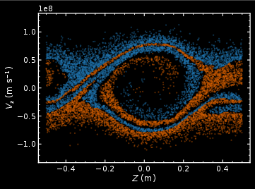
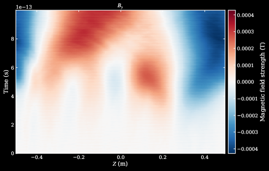
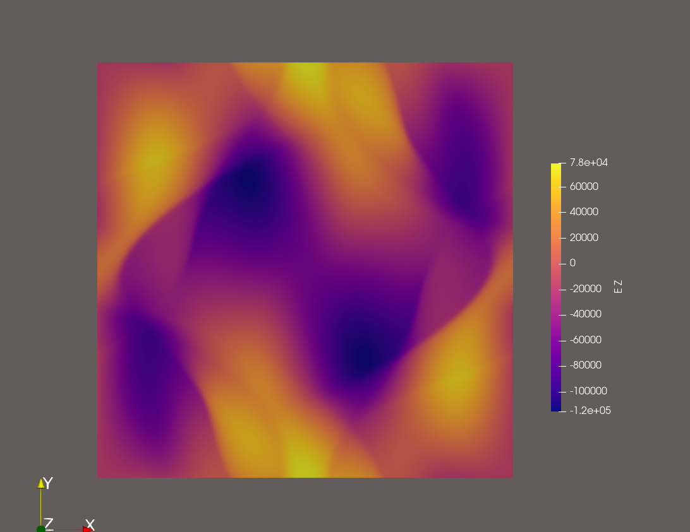

Demos
=====

Runnable examples live under ``demos/``. Run commands from the repository root
unless a demo first generates local ``.npy`` initial conditions.

Two-Stream Instability
----------------------

   two-stream instability phase-space diagram.

The two-stream instability demo uses one tile:

.. code-block:: bash

   PyPIC3D --config demos/two_stream/two_stream.toml

Weibel Instability
------------------

   Weibel instability magnetic field evolution.

.. code-block:: bash

   PyPIC3D --config demos/weibel/weibel.toml

Orszag-Tang Vortex
------------------

   Orszag-Tang vortex out-of-plane electric field.

.. code-block:: bash

   cd demos/ot_vortex
   python initial_conditions.py
   PyPIC3D --config orszag_tang.toml

Still under development.

Harris-Sheet Reconnection
-------------------------

.. code-block:: bash

   cd demos/reconnection_2d
   python initial_conditions.py
   CUDA_VISIBLE_DEVICES=0,1 JAX_PLATFORMS=cuda \
     PyPIC3D --config harris_current.toml
   python analyze_data.py

The configuration uses two x-directed tiles and therefore needs two visible
JAX devices. The analysis command reads ``data/fields.pmd`` and writes four
normalized MP4 diagnostics to ``analysis/``: reconnecting field lines,
effective nonideal resistivity, and x- and z-directed bulk-flow cuts.

Notes
-----

- Orszag-Tang and Harris-sheet runs load field and particle arrays generated
  by their ``initial_conditions.py`` scripts.
- Output locations come from each demo's ``output_dir`` setting or default to
  the directory where the command is launched.
- A multi-tile demo needs one exposed JAX device per tile. See :doc:`tiling`
  before reducing the configured tile widths.
