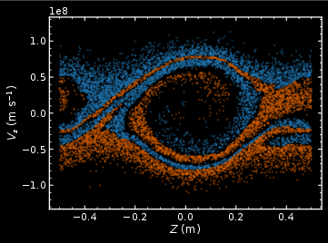
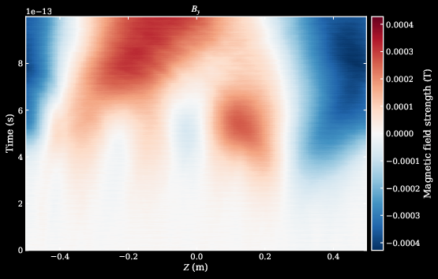
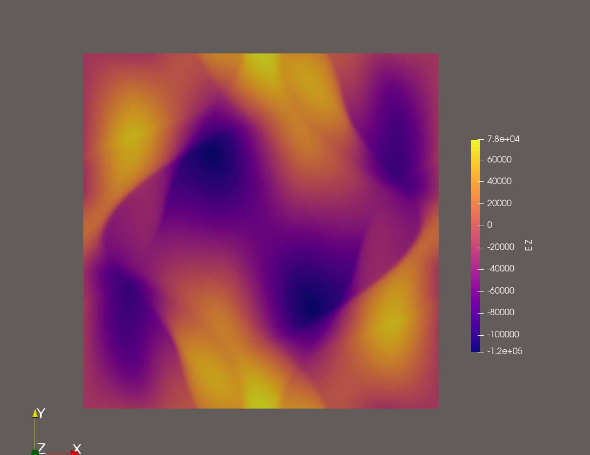

Demos
=====

Runnable examples live under ``demos/``. Run commands from the repository root
unless a demo first generates local ``.npy`` initial conditions.

Two-Stream Instability
----------------------

   two-stream instability phase-space diagram.

The two-stream instability demo uses one tile:

.. code-block:: bash

   PyPIC3D --config demos/two_stream/two_stream.toml

Weibel Instability
------------------

   Weibel instability magnetic field evolution.

.. code-block:: bash

   PyPIC3D --config demos/weibel/weibel.toml

Orszag-Tang Vortex
------------------

   Orszag-Tang vortex out-of-plane electric field.

.. code-block:: bash

   cd demos/ot_vortex
   python initial_conditions.py
   PyPIC3D --config orszag_tang.toml

Still under development.

Harris-Sheet Reconnection
-------------------------

.. code-block:: bash

   cd demos/reconnection_2d
   python initial_data.py
   CUDA_VISIBLE_DEVICES=0,1 JAX_PLATFORMS=cuda \
     PyPIC3D --config harris_current.toml
   python analyze_data.py

The configuration uses two x-directed tiles and therefore needs two visible
JAX devices. The analysis command reads ``data/fields.pmd`` and writes
``analysis/field_lines.mp4``. The movie shows the full x domain and supported
cell-centered z extent, with normalized coordinates, time, and magnetic
magnitude. A two-cell Gaussian display filter smooths the field lines;
the color scale stays fixed throughout the movie. Only the magnetic mesh is
required. Use ``--fields``, ``--output-dir``, ``--fps``, and ``--dpi`` to override
the input, output directory, frame rate (10), and resolution (150).

Blandford-Znajek Monopole
-------------------------

A monopole magnetosphere around a spinning Kerr black hole in
horizon-penetrating spherical Kerr-Schild coordinates, following Entity
Paper II (Section 4.5). Settings live in ``simulation_parameters.py``; the
runner takes no arguments.

.. code-block:: bash

   cd demos/static_metric_relativity/bz_monopole
   python run_bz_monopole.py
   python plot_entity_bz.py --data data --all

The run writes snapshots, ``diagnostics.npz`` and ``final_state.npz`` to
``data/`` and stops if the exterior Gauss or divergence-of-B residuals exceed
their tolerances. ``plot_entity_bz.py`` redraws the Figure 6 panels from the
saved snapshots. Figures and animations take their angular extent from each
snapshot's saved theta coordinates.

The demo uses the general static-metric finite-difference field updates and
standard metric-weighted E/H interpolation. Set ``theta_start`` and
``theta_end`` in radians; defaults are 10 and 170 degrees with 64 angular
cells. Field and particle boundaries are independent directional tuples:
``boundary_conditions=(3, 1, 0)`` and
``particle_boundary_conditions=(2, 1, 0)``. These retain the radial treatment,
use metric-projector conducting fields and reflecting particles in theta, and periodic phi
with one cell. Reflections retain azimuth. Both angular endpoints must leave
space for all metric guard nodes inside the regular spherical chart; radial
guard nodes must remain above r=0. These checks precede metric initialization.

The particle metric uses Hermite reconstruction. Source filtering acts on
conformal charge/current and is checked with the same finite-difference
divergence as the field solver. Long production runs with the conducting
angular boundaries remain to be validated.

For a short CPU diagnostic, call the runner from the repository root with
an unused output directory:

.. code-block:: python

   from demos.static_metric_relativity.bz_monopole.run_bz_monopole import run
   from demos.static_metric_relativity.bz_monopole.simulation_parameters import SimulationParameters

   run(SimulationParameters(backend="cpu", end_time=1., output_interval=.1,
                            output_directory="/tmp/bz_standard_t1"))

The production endpoint remains ``end_time=200``. Validation through t=1 M
establishes startup behavior, not long-time stability.

For a numerical regression comparison, run the original and modified solver
with identical parameters, seed, backend, and device count into separate
directories, using ``end_time=1.`` and ``output_interval=.1``. Then run:

.. code-block:: bash

   python demos/static_metric_relativity/bz_monopole/compare_runs.py \
       /tmp/bz_baseline_t1 /tmp/bz_densitized_t1 --output /tmp/bz_comparison.json

The comparison checks every diagnostic snapshot and the physical final
field/particle arrays. It requires identical active masks and discrete
particle outcomes, a per-array error below ``1e-9 * max(1, max(abs(reference)))``,
and the existing ``1e-10`` exterior constraint limits. Nonfinite diagnostic
masks must agree. The final endpoint must be exactly t=1 M. Runtime Maxwell
state is densitized; saved D/B/J arrays remain physical contravariant values.

Vacuum Kerr Superradiant Scattering
----------------------------------

An inward electromagnetic ``l=m=1`` dipole seed in a Cartesian Kerr-Schild
box, with no particles or continuing sources. All six faces use the
production FIDO D/B PEC logic on the evolved densities. A demo-local interior absorber and finite core
metric remain inside the horizon.

.. code-block:: bash

   python -m demos.static_metric_relativity.superradiant_scattering.run_demo \
       --config demos/static_metric_relativity/superradiant_scattering/smoke.toml

Use ``kerr.toml`` for the 128^3, 500 M experiment or ``schwarzschild.toml``
for its nonrotating control. ``--output-dir`` selects the destination;
``--overwrite`` replaces only this demo's artifacts. The demo runs on one
JAX device and requires several GB for its full grid.

Outputs include an incrementally flushed ``energy.csv``, run metadata,
``growth.json``, and ``energy_growth.png``. Diagnostics measure synchronized
FIDO energy, exterior Killing energy, horizon/wall energy fluxes, and vacuum
constraints. Growth fits report decay or unresolved/insufficient data as
appropriate. The 48^3 smoke preset checks startup only. Cartesian walls can
mix angular modes; physical superradiant growth requires a longer convergence
and energy-budget study. See the demo's ``README.md`` for equations, numerical
limitations, configuration options, and analysis commands.

Notes
-----

- Orszag-Tang and Harris-sheet runs load field and particle arrays generated
  by their ``initial_conditions.py`` and ``initial_data.py`` scripts.
- Output locations come from each demo's ``output_dir`` setting or default to
  the directory where the command is launched.
- A multi-tile demo needs one exposed JAX device per tile. See :doc:`tiling`
  before reducing the configured tile widths.
